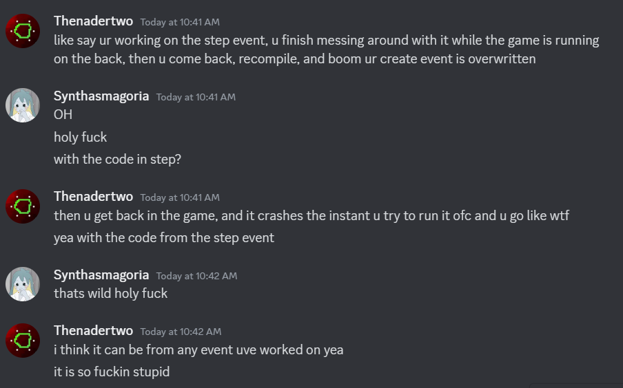
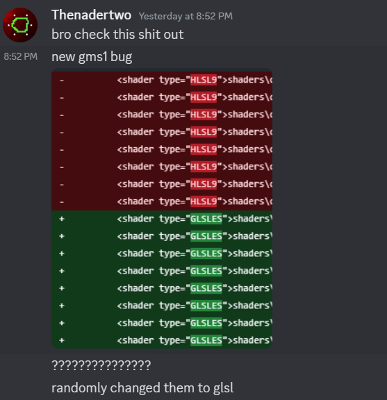
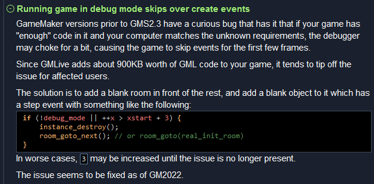

### Broken room functions
You can create new rooms and add tiles and instances to them using `room_add`, `room_tile_add`, and `room_instance_add`. However you cannot remove instances from rooms using `room_instance_clear`. Regardless of whether the room you're trying to clear of instances exists in the IDE, or it was created through code, it will not work.

*The extent of which the room functions are broken has not been researched*

### Included files (datafiles) multiple projects open
If you have more than one project open and change the included files there is a chance that they'll end up in the wrong project. The included file will appear in the IDE but it will not be in the datafiles folder.

*The extent of which adding included files is broken has not been researched*

### GLSL loop bad transpilation to HLSL
Sometimes loops can cause bad transpilations. This will increase the compile time by a lot and will kill performance.

*The nature of bad transpilation needs to be more closely looked at*

### Random code event replacement
While the game is running it is possible that code you write for an event in the IDE will replace the code in the create event of an object when you save and recompile.


*Unknown cause*
### Debugger black screen
When a project is big enough opening the game with the debugger attached can result in a black screen. This could be caused by the GMLive extension (maybe big workload on startup).

*Mostly unknown cause*

### Setting sprite_index to itself with mask_index -1
mask_index -1 means that the instance is going to use the sprite for collision checks.
Setting sprite_index is going to change the bounding box to the sprite that is set.
You'd assume that nothing would happen if you do sprite_index == sprite_index, but in one case it made the difference between place_free returning true and false give identical circumstances aside from sprite_index having been set to itself the previous frame.

### Do until infinite loop crashes the IDE
If you create an do-until loop it will crash the editor as well as brick your game.

### Shader type can change randomly
When saving a project there is a chance that your shaders change type to GLSLES.


### Debugger stops working with "enough" code
Once your project exceeds a certain amount of code the debugger might start choking and skip over the create events of objects when the game starts. Here's what yal has to say about that.

```C
if (!debug_mode || ++x > xstart + 3) {
	instance_destroy();
	room_goto_next();
}
```

## Gamemaker floating point values don't match GLSL ES floating point values
When you pass floats to GLSL ES shaders there is a chance that the value will be rounded. This can become especially noticeable you're passing floating point uniforms that are used blend to images, or something similar.

If you have a time variable that increments by a 1/60 every frame then you'll have `1.9999999999999978` by the time you're nearing 2 seconds of time in a 60 fps game. If you pass this number to a shader then it'll round up to 2.x. Meaning that if you're using the fractional portion of the value to calculate something then it'll be out of sync with what the value is in GML.

Create:
```c
time = 1.9999999999999978;
```
Draw:
```c
shader_set(shGmlFloatVsGlslEsFloat);
shader_set_uniform_f(
	shader_get_uniform(shGmlFloatVsGlslEsFloat, "over098"),
	frac(time) > 0.998);
shader_set_uniform_f(
	shader_get_uniform(shGmlFloatVsGlslEsFloat, "value"),
	time);
draw_rectangle(0, 0, room_width, room_height, false);
shader_reset();
time += 1.0 / game_get_speed(gamespeed_fps);
```
Fragment shader:
```c
uniform float value;
uniform float over098;

void main() {
    float out_of_sync;
	if (fract(value) < 0.98 && over098 == 1.0) {
		out_of_sync = 1.0;
	} else {
		out_of_sync = 0.0;
	}
	gl_FragColor = vec4(value, out_of_sync, 0.25, 1.0);
}
```

The following shader produces a yellow square when 'value' has been rounded up past the threshold of numbers. When running it should flicker every few seconds.

## v_vTexcoord as input to a random function
Take the following random function:
```c
vec2 random2(vec2 p) {
    vec3 p3 = fract(p.xyx * vec3(443.897, 441.423, .0973));
    p3 += dot(p3, p3.yzx + 19.19);
    return fract((p3.xx + p3.yz) * p3.zy);
}
```
As with all random functions a minute difference in input causes a completely different output.

Now consider this shader that scatters pixels randomly
```c
void main(void)
{
    vec2 s = (random2(v_vTexcoord) * 2.0 - 1.0) * scatter;
    fragColor = texture2D(gm_BaseTexture, v_vTexcoord + s);
}
```
It will use the texture sample coordinates as an input for the random value generator.

This solution will work, but only as long as the object drawing the sprite doesn't move at a fractional speed. If it did then the sample coordinates will be between pixels (this is most likely due to texture interpolation features that make moving objects look more smooth when they're between pixels).
In order to prevent the noise from looking animated you can pass the texel size of the texture being drawn, and then round down to the nearest pixel:
```c
void main(void)
{
	vec2 pos = floor(v_vTexcoord / texel_size) * texel_size;
    vec2 s = (random2(pos) * 2.0 - 1.0) * scatter;
    fragColor = texture2D(gm_BaseTexture, v_vTexcoord + s);
}
```
