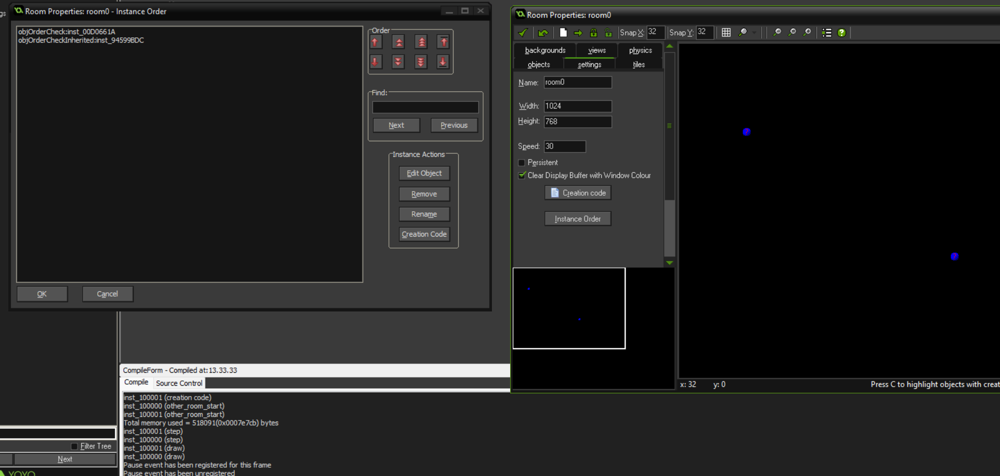

### Common event execution in detail (+ instance ids)
Code execution order is something I've always just understood through intuition. When working with step code I've always tried avoiding coding things that rely on execution order. In terms of draw code my understanding has been that it relies on depth. Most of the time I've gotten away with these shallow assumptions. So how does it really work?

First interesting thing to note about instances is that the instance_ids in the instance order window in Gamemaker's room editor don't reflect the in game id's.


Two instances of the same depth and object type placed in the same room:
```
inst_100000 (create)
inst_100000 (creation code)
inst_100001 (create)
inst_100001 (creation code)
inst_100000 (other_room_start)
inst_100001 (other_room_start)
inst_100000 (step)
inst_100001 (step)
inst_100001 (draw)
inst_100000 (draw)
```
inst_100000 was placed first. inst_100001 was placed second.

Two instances of the same depth were placed in a room. The second instance (inst_100001) is after the first (inst_100000) in the resource tree:
```
inst_100000 (create)
inst_100000 (creation code)
inst_100001 (create)
inst_100001 (creation code)
inst_100000 (other_room_start)
inst_100001 (other_room_start)
inst_100000 (step)
inst_100001 (step)
inst_100001 (draw)
inst_100000 (draw)
```
Two instances of the same depth were placed in a room. The second instance (inst_100001) is before the first (inst_100000) in the resource tree:
```
inst_100000 (create)
inst_100000 (creation code)
inst_100001 (create)
inst_100001 (creation code)
inst_100000 (other_room_start)
inst_100001 (other_room_start)
inst_100001 (step)
inst_100000 (step)
inst_100001 (draw)
inst_100000 (draw)
```

Two instances were placed in a room. inst_100001 was given depth -1 in creation code. The second instance (inst_100001) is before the first (inst_100000) in the resource tree:
```
inst_100000 (create)
inst_100000 (creation code)
inst_100001 (create)
inst_100001 (creation code)
inst_100000 (other_room_start)
inst_100001 (other_room_start)
inst_100001 (step)
inst_100000 (step)
inst_100000 (draw)
inst_100001 (draw)
```

- As expected depth execution order of draw events. Lower depth = later drawing, which means that code execution is later.
- It turns out the Create event, Creation Code, and the Room Start event depend on instance order in the room. They were not affected by changes in depth in creation code or order changes in the resource tree.
- The step event depends on object order in the resource tree. It wasn't affected by instance order in the room or depth.

### Project file references and compiler optimization
The XML in the main project file (\*.project.gmx) dictates which resources are compiled as part of the final project. If you take out, let's say, a room from the project file, then that room will disappear from the IDE. However, that room resource will still exist in the project's room folder. If you don't use hardcoded room references
then the project will compile and you will be able to run the game like normal, but with the room missing. When you add the resource back into the project file it will re-appear in the editor like nothing happened.

If you have a large project in which you're only testing a small part of the game at a time then you might want to consider using introspection for resource paths and removing resources which you're not testing in order to increase compile times.
### ### v_vTexcoord behavior
When you draw a sprite using a shader v_vTexcoord will be some range between 0.0-1.0. You don't know what it will be since you don't have control over where the sprite ends up on the texture page. To get predictable uv coordinates in the shader you can pass the sprite's uvs (`sprite_get_uvs(sprite_index, image_index)`) using a uniform and remapping the uvs.
```gml
var _uvs = sprite_get_texture(sprite_index, image_index);
shader_set_uniform_f(shader_get_uniform(sh, "uvs"), _uvs[0], _uvs[1], _uvs[2], _uvs[3]);
```
When drawing surfaces v_vTexcoord will always be 0.0-1.0.

### Script default return
Scripts that don't explicitly return anything will return 0.
