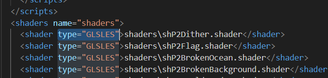
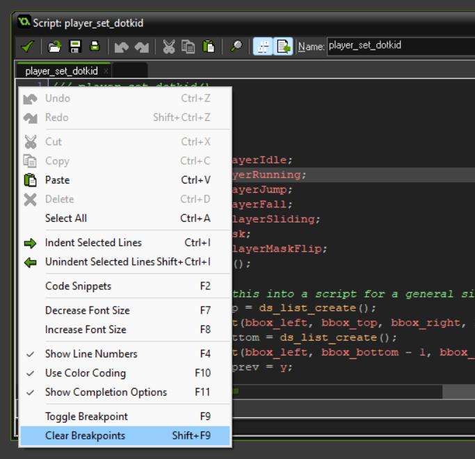

GmEdit is hugely useful for making the GMS1.4.9999 coding experience better. But it has some integration issues.
### Creating shaders
Creating a new shader using GmEdit will corrupt your project file.
The reason is that it will add the resource but with the 'type' attribute missing.
This issue can be fixed by adding the 'type' attribute

### Missing functions
- variable_instance_get_names
- ds_map_get

### Deleting code containing breakpoints
This can result in breakpoints existing past the end of the code. This will make them invisible in the IDE's GML editor. However these breakpoints can be cleared by right-clicking on the side and selecting "Clear breakpoints" (shift + F9).

### Creating scripts inside of scripts
When creating scripts inside of a script using `#define` the script index sometimes doesn't get assigned properly. Sometimes the script index of the new script in the nested script will be the last script index. And then on next compile the script indices will be reordered correctly again to be top-to-bottom.
